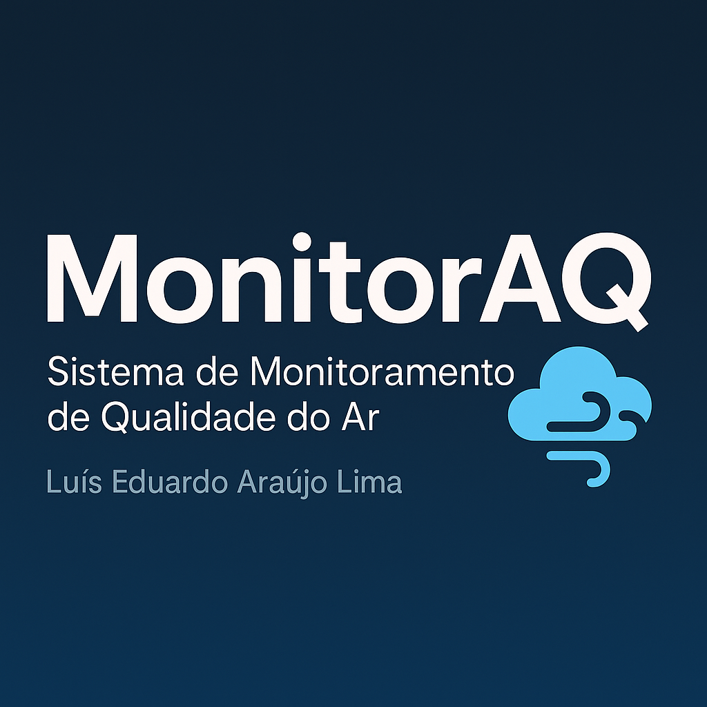

# MonitorAQ — Sistema de Monitoramento de Qualidade do Ar

  

  
  
  
  

---

## Sumário
- [Visão geral & Tese](#visão-geral--tese)  
- [Demonstração & Objetivos](#demonstração--objetivos)  
- [Arquitetura (inspirada no Hydra Launcher)](#arquitetura-inspirada-no-hydra-launcher)  
- [Componentes do repositório](#componentes-do-repositório)  
- [Como rodar / Deploy rápido](#como-rodar--deploy-rápido)  
- [Edge Function — ingestão segura (resumo)](#edge-function--ingestão-segura-resumo)  
- [Metodologia científica e avaliação](#metodologia-científica-e-avaliação)  
- [Boas práticas de segurança](#boas-práticas-de-segurança)  
- [Referências](#referências)  
- [Licença](#licença)  

---

## Visão geral & Tese
**Monitoração urbana distribuída de qualidade do ar** com coleta IoT, ingestão segura em nuvem e previsão de curto prazo (nowcasting) para apoiar decisões operacionais e políticas locais.

**Tese (resumida):**  
> *Um sistema distribuído de baixo custo composto por sensores IoT, ingestão por Edge Functions e modelos de ML leves pode fornecer previsões de curto prazo (1–6 horas) de PM2.5 com precisão suficiente para alertas operacionais em municípios de pequeno porte.*

### Hipóteses
1. Agregando leituras de sensores econômicos é possível estimar o AQI com erro operacionalmente aceitável.  
2. Modelos leves (regressão linear, XGBoost compacto, LSTM pequeno) produzem previsões úteis para nowcasting.  
3. Uso de Edge Functions melhora a segurança e escalabilidade comparado ao envio direto ao DB público.

---

## Demonstração & Objetivos
- Dashboard interativo com leituras em tempo real (PM2.5, PM10, NO₂).  
- Simulação local de sensores e ingestão real via **Supabase**.  
- Ingestão segura via **Edge Function (Deno)** que valida `device_token` e grava com `service_role`.  
- Previsão simples embutida (regressão linear) com opção de TF.js para modelos mais ricos.  
- Dados de exemplo para **Campo Maior, PI**.

---
